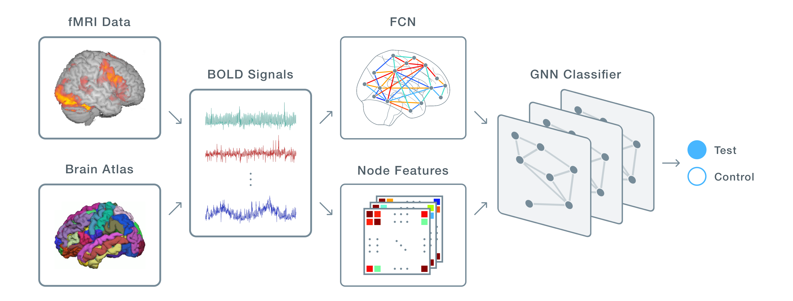

# DeepFCN

DeepFCN is a deep learning tool for predicting individual differences (e.g. classifying subjects with vs. without autism) from [functional connectivity networks (FCNs)](https://www.sciencedirect.com/topics/medicine-and-dentistry/functional-connectivity).

It employs a [Graph Neural Network (GNN)](https://en.wikipedia.org/wiki/Graph_neural_network) as a predictive model and offers control over every step in the deep learning pipeline, from feature extraction to designing and training the GNN. All you need is a labeled fMRI dataset to get started.



<!--```python
from deepfcn.data import create_examples, drop_outliers, drop_weak_edges
from deepfcn.gnn import create_gnn, cross_validate

def load_dataset():
  # You implement this
  pass

test_subjects, control_subjects, roi_masker = load_dataset()

dataset = create_examples(test_subjects, label=0, roi_masker=roi_masker)
dataset += create_examples(control_subjects, label=1, roi_masker=roi_masker)

drop_weak_edges(dataset, cutoff=0.10)
drop_outliers(dataset, cutoff=0.05)

gnn = create_gnn(dataset)
results = cross_validate(dataset, gnn, k=5, epochs=200)
```-->

## Installation

You can install DeepFCN from PyPi:

```bash
$ pip install deepfcn
```

## Introduction by Example

We'll introduce the features of DeepFCN by applying it to the [Autism Brain Imaging Data Exchange (ABIDE) dataset](https://fcon_1000.projects.nitrc.org/indi/abide/). Our goal is to train a model to predict whether a subject is diagnosed with autism.<!--, and to identify functional biomarkers of the disorder.-->

### Loading the Dataset

We'll use the `nilearn` library to load the ABIDE dataset and a cortical [brain atlas](https://en.wikipedia.org/wiki/Brain_atlas), which we'll use to parcellate the brain into regions of interest (ROIs):

```python
import numpy as np
from nilearn.datasets import fetch_abide_pcp, fetch_coords_power_2011
from nilearn.input_data import NiftiSpheresMasker

autism_subjects = fetch_abide_pcp(DX_GROUP=1)["func_preproc"]
control_subjects = fetch_abide_pcp(DX_GROUP=2)["func_preproc"]

atlas = fetch_coords_power_2011()
coords = np.vstack((atlas.rois["x"], atlas.rois["y"], atlas.rois["z"])).T
roi_masker = NiftiSpheresMasker(seeds=coords, radius=5.0)
```

### Preparing the Dataset

The next step is to convert the subjects into data examples that can be submitted to a GNN. A single example is described by an instance of `deepfcn.data.Example`, which has following attributes:

1. **`node_features` _(numpy.ndarray)_:** Node feature matrix with shape `[num_nodes, num_node_features]`, where `num_nodes == num_rois`
2. **`fc_matrix` _(numpy.ndarray)_:** 3D functional connectivity matrix with shape `[num_nodes, num_nodes, num_fc_features]`; represents a multi-edge FCN, where each edge corresponds to a different measure of functional connectivity (e.g. correlation, covariance)
3. **`y` _(int)_:** Target to train against (e.g. `0` for autism, `1` for control)

To convert the ABIDE dataset into a set of examples, we'll use the `deepfcn.data.create_examples` function. This takes a set of fMRI scans (NiftiImage objects) as input and, for each scan, extracts the BOLD time series for each ROI, constructs an FCN, and extracts features to build an `Example` object. The method has the following parameters:

1. **`images` _(list)_:** List of NiftiImage objects, each corresponding to a subject's fMRI scan
2. **`label` _(int)_:** Integer representing the target variable (i.e. `y`)
3. **`roi_masker` _(NiftiMasker)_:** Mask to apply when extracting time series
4. **`fc_features` _(list, optional (default=["correlation"]))_:** List of connectivity measures to use; options are listed in [this table](#fc-features)
5. **`node_features` _(list, optional (default=["mean"]))_:** List of node features to extract; options are listed in [this table](#node-features)
6. **`n_jobs` _(int, optional (default=multiprocessing.cpu_count()))_:** Number of CPUs to split up the work across
<!--7. **`bootstrap`**-->
<!--TODO: Implement subject-level predictions-->

In our example, we'll use `"correlation"` and `"dtw"` ([Dynamic Time Warping](https://en.wikipedia.org/wiki/Dynamic_time_warping)) as our connectivity measures, and `"mean"`, `"variance"`, and `"entropy"` as our node features:

```python
from deepfcn.data import create_examples

fc_features = ["correlation", "dtw"]
node_features = ["mean", "variance", "entropy"]

examples = create_examples(autism_subjects, label=0, roi_masker=roi_masker,
                           fc_features=fc_features, node_features=node_features)
examples += create_examples(control_subjects, label=1, roi_masker=roi_masker,
                           fc_features=fc_features, node_features=node_features)
```

If you wanted to define your own `create_examples` function, DeepFCN provides some helpers:

1. `deepfcn.data.extract_signals(niimg, roi_masker)`: Extracts the BOLD time series for each ROI
2. `deepfcn.data.extract_fcn(signals, feature_names)`: Creates a FCN from time series data
3. `deepfcn.data.extract_node_features(signals, feature_names)`: Extracts node/ROI features from time series data

### Preprocessing the Dataset

Now that we have a set of examples, the next step is to preprocess those examples before submitting them to a model. DeepFCN provides functions for cleaning graph-structured data, which we'll walk through below.

#### Dropping Outliers

Because there's no standard way to compare FCNs, there's also no standard way to detect outliers in our dataset. Most approaches to graph outlier detection involve a neural network approach, but DeepFCN provides another technique for dropping outliers, `deepfcn.data.drop_outliers`:

```python
from deepfcn.data import drop_outliers

examples = drop_outliers(examples, cutoff=0.05)
```

This function uses the [outgraph package](https://github.com/shobrook/outgraph) to detect outliers based on their [Mahalanobis distance](https://en.wikipedia.org/wiki/Mahalanobis_distance) from the distribution of examples in the dataset.

#### Dropping Weak Connections

Within a FCN, there may be weak edges that represent noise rather than connectivity, and dropping them can improve performance of the GNN. `deepfcn.data.drop_weak_connections` allows you to identify such edges and drop the ones below a connectivity threshold. If there are multiple connectivity measures associated with an edge, then only the first one is compared against the threshold. In our example, we'll drop the weakest **10%** of edges from each example based on their correlation:

```python
from deepfcn.data import drop_weak_connections

examples = drop_weak_connections(examples, cutoff=0.10)
```

Note that since some functional connectivity measures, such as correlation, are such that negative values are just as meaningful as positive values, only the absolute value is used –– e.g. a connectivity of `-0.5` is considered stronger than `0.3`.

Also note that only the first FC feature is used in this procedure.

<!--#### TODO: Normalizing Features-->

<!--#### TODO: Class Balancing-->

### Preparing the GNN

Now that we've prepared our dataset, the next step is to create a GNN. This only takes one line of code to do:

```python
from deepfcn.model import create_gnn

gnn = create_gnn(examples)
```

By default, this function will autoconfigure the GNN parameters based on the number of node and edge features in the example set. It returns a PyTorch `nn.Module` object that leverages the `NNConv` and `global_mean_pool` functions from [PyTorch Geometric](https://pytorch-geometric.readthedocs.io/en/latest/), a graph classification library. If you want more control over how the GNN is configured, DeepFCN lets you tune various hyperparameters, listed below:

1. **`num_node_features` _(int)_:** Number of node features in each input example
2. **`num_edge_features` _(int)_:** Number of edge features in each input example
3. **`hidden_channels` _(list)_:** List of hidden channel sizes for each layer in the GNN; length of list corresponds to number of layers in the GNN
4. **`use_pooling` _(bool)_:** Boolean indicating whether or not to use top k pooling after each layer in the GNN
5. **`dropout_prob` _(float)_:** Dropout probability to be applied to each GNN layer
6. **`global_pooling_mode` _(str)_:** Type of global pooling to use; options are `"mean"`, for `global_mean_pooling`, and `"attention"`, for `GlobalAttention`
7. **`conv_activation_func` _(nn.Module)_:** Activation function to apply to the output of each graph convolution; must be a [PyTorch activation function](https://pytorch.org/docs/stable/nn.html#non-linear-activations-weighted-sum-nonlinearity)
8. **`edge_nn_kwargs` _(dict)_:** TODO
9. **`output_nn_kwargs` _(dict)_:** TODO

These are all _parameters_ in the `deepfcn.gnn.create_gnn` function.

### Training and Testing the GNN

DeepFCN offers a predefined and configurable training loop, `deepfcn.gnn.cross_validate`, to save you the trouble of creating your own. It has the following parameters:

1. **`examples` _(list)_:** List of example objects (i.e. your dataset)
2. **`gnn` _(nn.Module)_:** PyTorch module representing the GNN to train and test (e.g. the output of `create_gnn`)
3. **`k` _(int, optional (default=1e-3))_:** Number of folds to create for k-fold cross-validation
4. **`lr` _(float, optional (default=1e-3))_:** Learning rate
5. **`epochs` _(int, optional (default=100))_:** Number of epochs to train for
6. **`verbose` _(bool, optional (default=True))_:** If `True`, training logs will be written to `stdout`
<!--4. **`early_stopping_step` _(int, optional (default=0))_:** Interval (in epochs) by which validation error is checked and used for [early stopping](https://en.wikipedia.org/wiki/Early_stopping#Validation-based_early_stopping); if `0`, no validation set is used to halt training-->

```python
from deepfcn.gnn import cross_validate

results = cross_validate(examples, gnn, k=5, epochs=200)
```

This function returns a list of dictionaries, each holding the cross-validation results for an epoch. The dictionaries have the following keys: `"train_accuracy"`, `"test_accuracy"`, `"test_precision"`, `"test_recall"`, `"loss"`. Each key holds a list of `k` values, where each value corresponds to a fold used in cross-validation.

Because `gnn` is just a PyTorch module, you can also create your own training loop. Just note that doing so will require calling the `to_data_obj()` instance method on your `deepfcn.data.Example` objects to convert them into objects consumable by PyTorch Geometric modules.

### Visualizing Results

TODO

## Reference

### FC Features

| Feature           | Description                                                                                                                                                         |
|-------------------|---------------------------------------------------------------------------------------------------------------------------------------------------------------------|
| correlation       | Pearson correlation coefficient between the signals associated with two nodes/ROIs.                                                                                 |
| dtw               | Speed-adjusted similarity between the two signals, calculated using the dynamic time warping algorithm.                                                             |
| granger_causality | Probability that activity in one node predicts the other.                                                                                                           |
| efficiency        | Multiplicative inverse of the shortest path distance between two nodes. Distance between two nodes is measured as the inverse of the absolute value of correlation. |

### Node Features

| Feature                | Description                                                                                                                                                                              |
|------------------------|------------------------------------------------------------------------------------------------------------------------------------------------------------------------------------------|
| entropy                | Complexity of the node's signal, based on approximate entropy of the time series.                                                                                                        |
| fractal_dim            | Complexity of the node's signal, based on the fractal dimension of the time series.                                                                                                      |
| lyap_r                 | Largest Lyapunov exponent, calculated by applying the Rosenstein et al. algorithm to the time series. Positive exponents indicate chaos and unpredictability.                            |
| dfa                    | Measure of the "long-term memory" of a node's signal, computed using detrended fluctuation analysis.                                                                                     |
| mean                   | Mean of the node's signal.                                                                                                                                                               |
| median                 | Median of the node's signal.                                                                                                                                                             |
| range                  | Range of the node's signal.                                                                                                                                                              |
| std                    | Standard deviation of the node's signal.                                                                                                                                                 |
| auto_corr              | Auto-correlation of the node's signal.                                                                                                                                                   |
| auto_cov               | Auto-covariance of the node's signal.                                                                                                                                                    |
| weighted_degree        | Weighted degree of the node, calculated by averaging the connectivity (correlation) of all its edges.                                                                                    |
| clustering_coef        | Clustering coefficient for the node, where correlation is used as edge weight.                                                                                                           |
| closeness_centrality   | Reciprocal of the average shortest path distance to the node over all n-1 reachable nodes. Distance between two nodes is measured as the reciprocal of their connectivity (correlation). |
| betweenness_centrality | Sum of the fraction of all-pais shortest paths that pass through the node.                                                                                                               |

# Authors

`DeepFCN` was created by Jonathan Shobrook and [Paul C. Bogdan](https://github.com/paulcbogdan/) as part of our research in the [Dolcos Lab](https://dolcoslab.beckman.illinois.edu/) at the Beckman Institute for Advanced Science and Technology.
